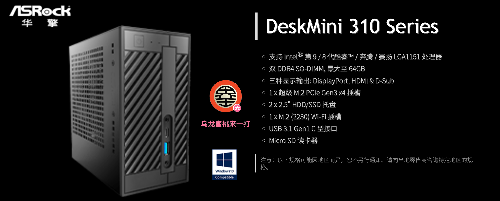

# ASRock DeskMini 310 Hackintosh OpenCore EFI

### [简体中文](README.zh_CN.md)

### OpenCore

[OpenCore 0.9.2](https://github.com/acidanthera/OpenCorePkg)

### OS Version Tested

- macOS Monterey 12.x
- macOS Ventura  13.x 

### Hardware

- Motherboard:ASRock H310 Mini-STX

### Notes

 - Use [OpenCore Configurator](https://mackie100projects.altervista.org/opencore-configurator/) build your SMBIOS
 
 
### Contact Us 

- QQ Group: 23304408

