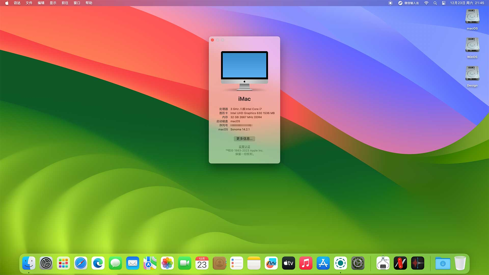

# 华擎科技 DeskMini 310 黑苹果 OpenCore EFI


### [English](https://github.com/hackintosh-efi/ASRock-DeskMini-310)

### OpenCore

[OpenCore 0.9.9](https://github.com/acidanthera/OpenCorePkg)

### 可安装系统

- macOS Monterey 12.x 
- macOS Ventura    13.x 
- macOS Sonoma  14.x 


### 硬件

- BIOS版本: P4.40  2020-01-17
- 主  板: ASRock H310M-STX/COM
- 处理器: 英特尔 9代 i7-9700
- 核   显: 英特尔超核心显卡630
- 内   存: 挚科 32G（16G*2）DDR4 2666 Mhz
- 固   态: 金胜维 KingSpec NX2280 1TB Windows 11 + MacOS
- 声   卡: 瑞昱 ALC233
- 有   线: 英特尔 L219-V
- 无   线: BCM94360CS2

### BIOS设置

```
Advanced
  |-- CPU Configuration
      |-- CPU C states Support: Enabled
      |-- CFG Lock: Disabled
  |-- Chipset Configuration
      |-- Above 4G Decoding: Enabled
      |-- VT-D: Enabled
      |-- Onboard HD Audio: Enabled
  |-- Super IO Configuration
      |-- Serial Port: Disabled
  |-- USB Configuration
      |-- XHCI Hand-off: Enabled 

Security
  |-- Secure Boot: Disabled 
  |-- Intel Platform Trust Technology:: Enabled 

Boot 
  |-- Full Screen Logo: Disabled
  |-- CSM: Disabled
```

### 注意事项

 - 安装完成后请使用 [OpenCore Configurator](https://mackie100projects.altervista.org/opencore-configurator/) 生成自己的三码
 - 请使用电源键进行睡眠唤醒
 - 插入3.5mm耳机后不支持自动切换，请在声音设置中手动选择耳机设备
 - 同时接入3.5mm耳机和独立麦克风会导致睡眠唤醒后爆音，请拔掉设备重新插入

### 系统截图



### 特别鸣谢

远景论坛用户 ：[Coldsparkle](https://i.pcbeta.com/space-uid-4597992.html)  &  GITHUB用户 ：[viorel78](https://github.com/viorel78)    是同一个人

Ta 为 DeskMini H310 的ALC235声卡定制了专用 [Layout ID 18](https://github.com/acidanthera/AppleALC/pull/668)

在此对 Ta 表示感谢 ！

### 参考内容

[1.黑苹果安装过程演示](https://hackintosh.club/d/10000060)

[2.英特尔无线网卡WiFi驱动](https://hackintosh.club/d/10000015)

[3.英特尔无线网卡蓝牙驱动](https://hackintosh.club/d/10000017)

[4.我的B站黑苹果教程](https://space.bilibili.com/244390800/video)

[6.黑果之家](https://hackintosh.club/)

### 联系我们

- QQ群: 23304408

