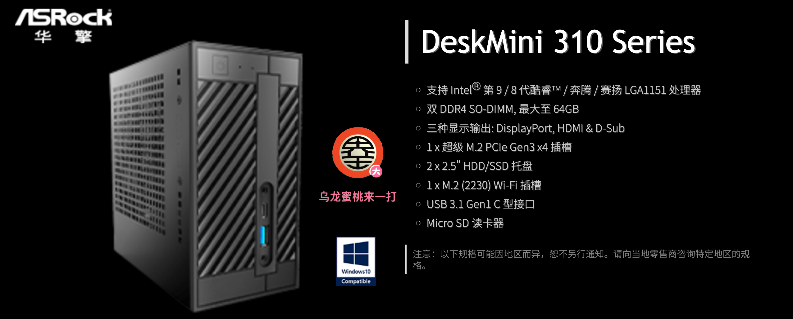
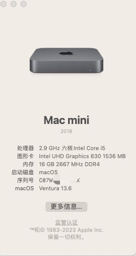

# 华擎科技 DeskMini 310 黑苹果 OpenCore EFI

### [English](https://github.com/hackintosh-efi/ASRock-DeskMini-310)

### OpenCore

[OpenCore 0.9.5](https://github.com/acidanthera/OpenCorePkg)

### 可安装系统

- macOS Monterey 12.x 
- macOS Ventura  13.x 
- macOS Sonoma  14.x 

### 硬件

- Motherboard:ASRock H310 Mini-STX

### 注意事项

 - 安装完成后请使用 [OpenCore Configurator](https://mackie100projects.altervista.org/opencore-configurator/) 生成自己的三码

### 联系我们

- QQ群: 23304408

